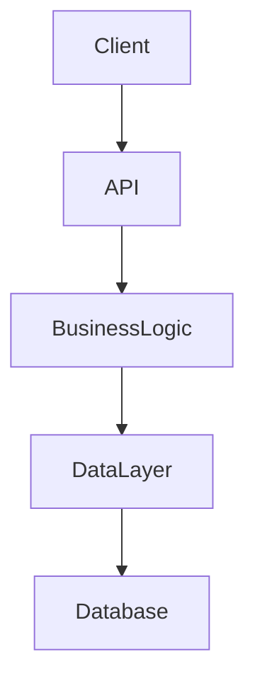

---

name: doc-update-arch
description: Обновление архитектурной документации
license: MIT
compatibility: opencode

---

Применяй после финализации design.md — отрази принятое
архитектурное решение в документации проекта.

## Что обновить

### 1. Общая архитектура проекта
Файл: `docs/full-project-architecture-note.md`

Обнови или создай с нуля:

```md
# Архитектура проекта

> Последнее обновление: YYYY-MM-DD | Задача: [DEV-XXX]

## Обзор
Краткое описание: какую проблему решает система, основные подсистемы.

## Слои

| Слой | Модули | Ответственность |
|------|--------|-----------------|
| API  | ...    | ...             |
| BL   | ...    | ...             |
| DAL  | ...    | ...             |

## Ключевые паттерны
- Паттерн: где применяется и зачем

## Точки интеграции
- Внешний сервис / модуль → как интегрирован

## Общая диаграмма



## Критические связи
Зависимости которые нельзя нарушать без последствий для системы.

## История решений
| Дата | Задача | Решение | Обоснование |
|------|--------|---------|-------------|
| YYYY-MM-DD | DEV-XXX | Что выбрано | Почему |
```

### 2. Таблица истории решений
При каждом обновлении добавляй строку в "История решений":
- Дата, номер задачи, выбранный вариант (A/B/C), краткое обоснование.

## Правила

- Отражай только принятый вариант — не все три варианта из design.md
- Не детализируй реализацию — это зона кодеров
- Фиксируй почему выбран этот вариант, а не другие — это ценнее самого решения
- Если архитектура не менялась — добавь только строку в историю решений

## Self-check

- [ ] Диаграммы отражают актуальные модули после этой задачи
- [ ] История решений обновлена
- [ ] Нет противоречий с design.md
