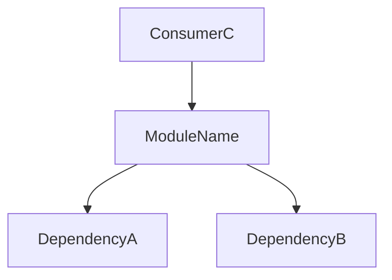

---

name: doc-update-module
description: Обновление документации модуля
license: MIT
compatibility: opencode

---

Применяй после завершения реализации — только для файлов
которые ты изменил в этой задаче. Не трогай документацию
незатронутых модулей.

## Каноническое имя файла документации

ОДИН исходный файл = ОДИН файл документации. Имя выводится
детерминированно из пути к исходному файлу — БЕЗ интерпретации:

```
canonical_path = "docs/" + <путь к файлу от корня проекта,
                            "/" заменён на "-", расширение отброшено> + ".md"
```

Примеры:
```
src/api/users/routes.py     →  docs/src-api-users-routes.md
src/components/Header.tsx    →  docs/src-components-Header.md
core/db/session.py           →  docs/core-db-session.md
```

Это правило не варьируется между запусками. Если в `explore-report.md`
есть раздел "Индекс документации" — бери `canonical_path` оттуда,
не вычисляй заново.

## Алгоритм

1. Составь список изменённых файлов из своей задачи
2. Для каждого файла вычисли `canonical_path` по правилу выше
3. Проверь существование файла по этому пути (glob/ls, не угадывание имени):
   - **Есть** → обнови ТОЛЬКО изменившиеся секции, имя файла не меняй
   - **Нет** → создай по `canonical_path` из шаблона ниже
4. ЗАПРЕЩЕНО создавать второй файл для того же исходного файла.
   Если кажется, что "подходящего" файла нет — пересчитай `canonical_path`,
   а не создавай новый документ.

## Шаблон файла документации

Путь: `canonical_path` (см. правило выше)

```md
# [Module Name]

> Последнее обновление: YYYY-MM-DD | Задача: [DEV-XXX]

## Назначение
2–3 предложения: что делает модуль, зачем существует, кто его использует.

## Компоненты

| Имя | Тип | Описание | Входы | Выходы |
|-----|-----|----------|-------|--------|
| FunctionName | function | Что делает | param: тип | тип |
| ClassName | class | Что делает | constructor args | instance |

## Связи

- **depends_on:** `module-a`, `module-b`
- **used_by:** `module-c`, `module-d`

## Диаграмма



## Примечания
- Edge cases и ограничения
- Известные TODO
- Неочевидное поведение
```

## Правила

- **Не придумывай** — только то что явно присутствует в коде
- **Имена точно совпадают** с кодом — копируй, не перефразируй
- **Если модуль неясен** — зафиксируй `[UNCLEAR: причина]` и продолжай
- **Один файл = один модуль** — не объединяй несколько модулей
- **Один исходный файл = один docs-файл** — никогда не создавай второй
  документ для уже задокументированного исходного файла
- **Имя файла = `canonical_path`** — заголовок `# [Module Name]` внутри
  может быть человекочитаемым, но имя файла строго каноническое
- **При обновлении** — меняй только секции затронутые твоими изменениями,
  остальное оставляй как есть

## Self-check перед сохранением каждого файла

- [ ] Имя файла равно `canonical_path` исходного файла
- [ ] Не создан дубль: по этому `canonical_path` не было другого файла
- [ ] Нет противоречий с другими файлами в `docs/`
- [ ] Диаграмма синтаксически корректна (нет незакрытых блоков)
- [ ] Все зависимости перекрёстно проверены
- [ ] Имена функций и классов точно совпадают с кодом
- [ ] Дата и номер задачи обновлены в заголовке
