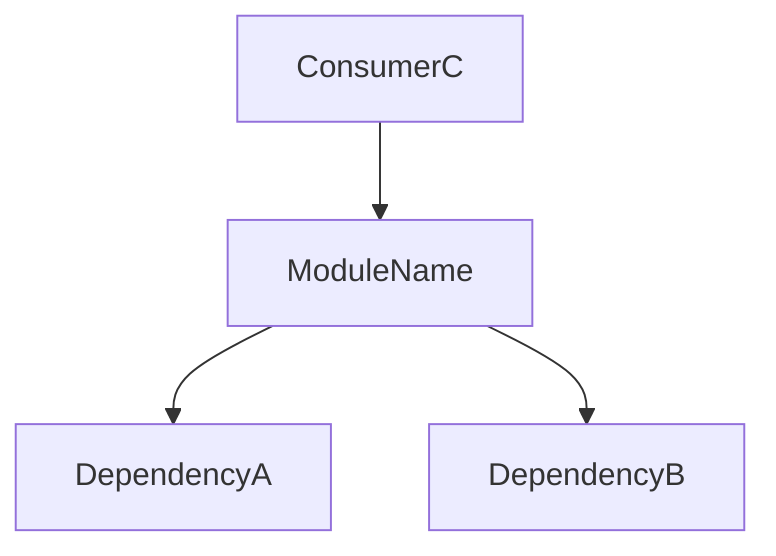

---

name: doc-update-module
description: Обновление документации модуля
license: MIT
compatibility: opencode

---

Применяй после завершения реализации — только для файлов
которые ты изменил в этой задаче. Не трогай документацию
незатронутых модулей.

## Алгоритм

1. Составь список изменённых файлов из своей задачи
2. Для каждого файла определи имя модуля
3. Проверь наличие `docs/full-project-[module-name]-note.md`
   - Есть → обнови только изменившиеся секции
   - Нет → создай с нуля по шаблону ниже

## Шаблон файла документации

Путь: `docs/full-project-[module-name]-note.md`

```md
# [Module Name]

> Последнее обновление: YYYY-MM-DD | Задача: [DEV-XXX]

## Назначение
2–3 предложения: что делает модуль, зачем существует, кто его использует.

## Компоненты

| Имя | Тип | Описание | Входы | Выходы |
|-----|-----|----------|-------|--------|
| FunctionName | function | Что делает | param: тип | тип |
| ClassName | class | Что делает | constructor args | instance |

## Связи

- **depends_on:** `module-a`, `module-b`
- **used_by:** `module-c`, `module-d`

## Диаграмма



## Примечания
- Edge cases и ограничения
- Известные TODO
- Неочевидное поведение
```

## Правила

- **Не придумывай** — только то что явно присутствует в коде
- **Имена точно совпадают** с кодом — копируй, не перефразируй
- **Если модуль неясен** — зафиксируй `[UNCLEAR: причина]` и продолжай
- **Один файл = один модуль** — не объединяй несколько модулей
- **При обновлении** — меняй только секции затронутые твоими изменениями,
  остальное оставляй как есть

## Self-check перед сохранением каждого файла

- [ ] Нет противоречий с другими файлами в `docs/`
- [ ] Диаграмма синтаксически корректна (нет незакрытых блоков)
- [ ] Все зависимости перекрёстно проверены
- [ ] Имена функций и классов точно совпадают с кодом
- [ ] Дата и номер задачи обновлены в заголовке
