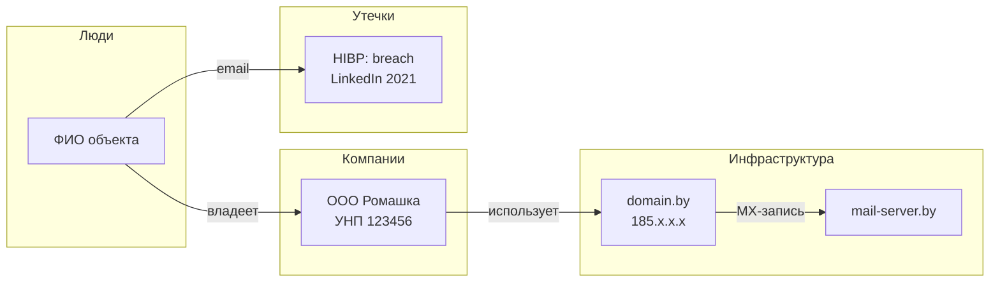
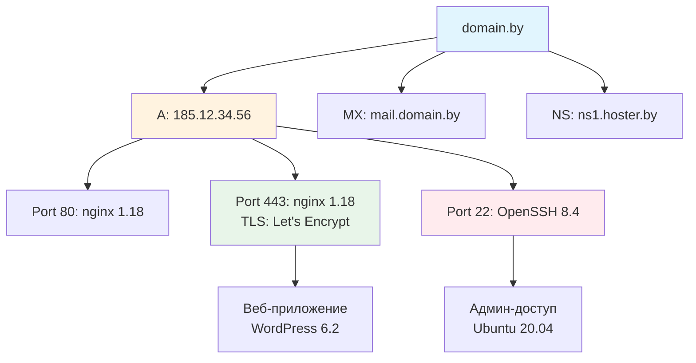
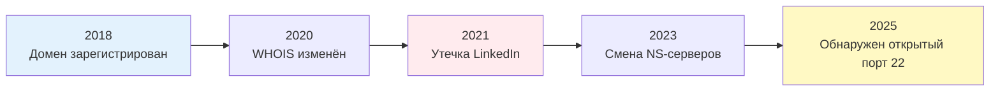
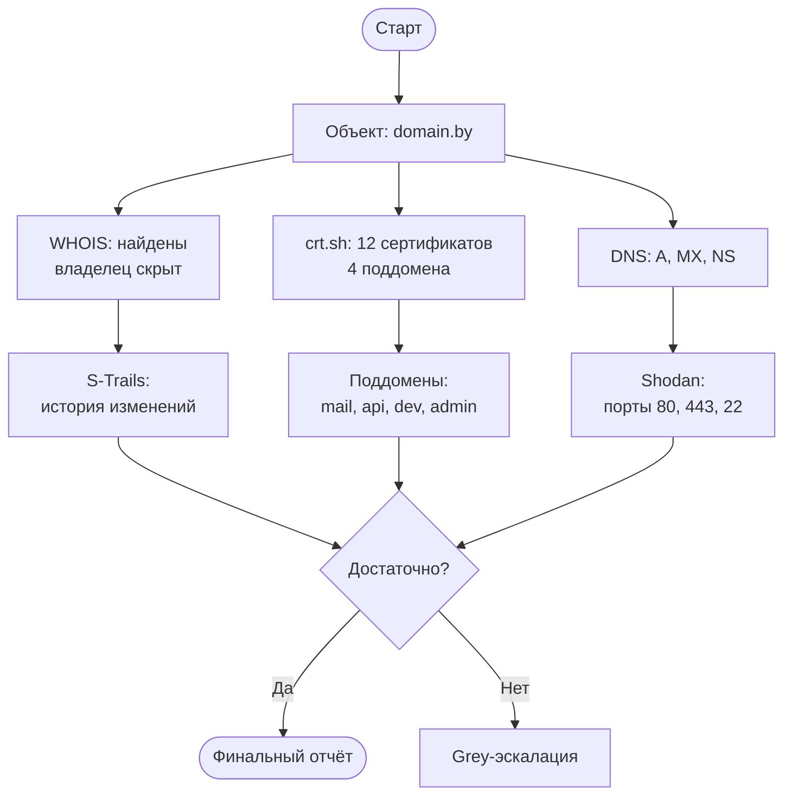
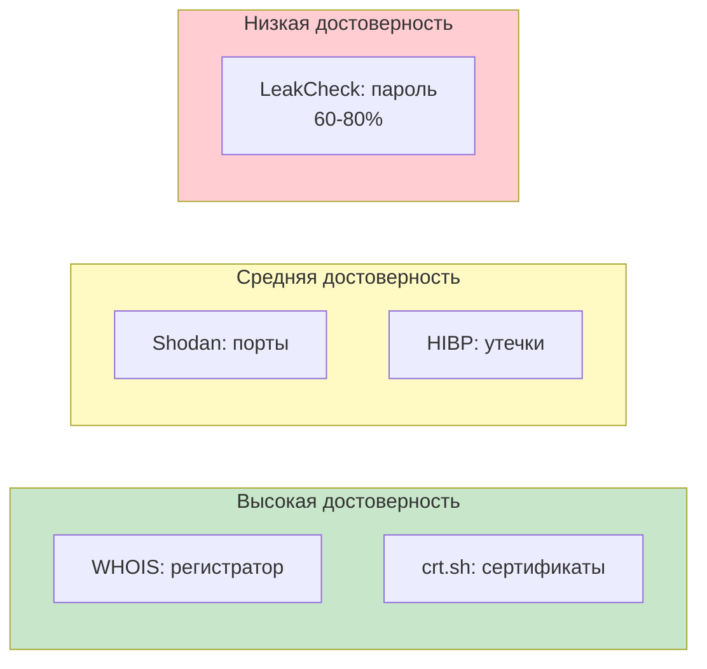

> ⚠️ **LOAD ORDER**: загружай этот навык на этапе формирования отчёта — ПОСЛЕ того, как все инструменты отработали, но ДО финального вывода пользователю. Не загружай в начале расследования.

---

## Часть 1 — Coverage Gate (обязательный гейт качества)

После завершения сбора данных и ДО формирования финального отчёта ты обязан выполнить **coverage gate** — явно спросить пользователя, достаточно ли собранной информации.

### Алгоритм

1. Сформируй **pre-report summary** — промежуточный срез собранного:
   ```
   [COVERAGE GATE — Предварительный срез]

   Собрано фактов: <N> (White: <n1>, Grey: <n2>)
   Типы источников: <перечислить, например: WHOIS, crt.sh, HIBP, Shodan>
   Пробелы: <перечислить явно, что НЕ удалось установить>

   Ключевые находки (3–5):
   - <факт 1>
   - <факт 2>
   - ...

   [ДОСТАТОЧНО ЛИ ДАННЫХ ДЛЯ ФИНАЛЬНОГО ОТЧЁТА?]

   Варианты:
   (a) Данных достаточно → формирую финальный отчёт
   (b) Нужно углубление → укажи направление:
       - <конкретное направление 1>
       - <конкретное направление 2>
       - ...
   (c) Нужны Grey-методы → запускаю протокол эскалации из osint-methodology
   ```

2. **Не генерируй финальный отчёт**, пока пользователь не выберет вариант (a), (b) или (c).

3. Обработка ответа:
   - **(a) Данных достаточно** → переходи к формированию финального отчёта (Часть 2).
   - **(b) Нужно углубление** → возвращайся к сбору данных по указанным направлениям (загрузи дополнительные инструментальные навыки при необходимости). После доуглубления — повторный coverage gate.
   - **(c) Grey-методы** → следуй протоколу эскалации из `osint-methodology`. После Grey — повторный coverage gate.

### Критерии достаточности

Считай данные достаточными, если:
- Закрыты все «обязательные» источники для типа объекта (см. routing-таблицу агента)
- На каждый вопрос из запроса пользователя есть хотя бы один источник
- Пробелы зафиксированы, и у каждого пробела указана причина (недоступен инструмент / требует Grey / вне scope)
- Есть хотя бы одна связь между объектами (граф не пустой), если запрос подразумевает исследование связей

Если критерии не выполнены — явно укажи это в coverage gate и предложи конкретные направления.

---

## Часть 2 — Формат отчёта

Выбери формат в зависимости от сложности:

### Short Report (простые задачи: 1 объект, 1–2 типа инструментов, White-only)

```markdown
# OSINT Report: <Тип объекта> — <Идентификатор>

**Дата:** YYYY-MM-DD
**Методы:** White
**Кэш:** [CACHE HIT / CACHE MISS]

## Результат

| # | Факт | Источник | URL | Метод |
|---|---|---|---|---|
| 1 | ... | ... | ... | White |
| 2 | ... | ... | ... | White |

## Пробелы и следующие шаги

- ...
- ...
```

### Full Report (комплексные задачи: ≥2 объектов, или ≥3 типов инструментов, или Grey-методы)

```markdown
# OSINT Report: <Тип> — <Идентификатор>

**Дата:** YYYY-MM-DD
**Методы:** White + Grey (если применялись)
**Юрисдикция:** <СНГ / ЕС / ...>
**Кэш:** [CACHE HIT / CACHE MISS]

---

## 1. Executive Summary

Краткие ключевые факты: 5–10 строк, без деталей.

## 2. Карта источников

| # | Факт | Источник | URL | Дата источника | Достоверность | Метод |
|---|---|---|---|---|---|---|
| 1 | ... | Shodan | https://... | 2025-01-15 | Высокая | White |
| 2 | ... | LeakCheck | API | 2024-11-03 | 70% | [GREY] |

## 3. Граф связей

<см. Часть 3 — Mermaid-диаграммы>

## 4. Инструменты и скрипты

Перечисли использованные инструменты из навыков. Если запускались скрипты — укажи команды.

## 5. Пробелы

| Пробел | Причина | Возможное решение |
|---|---|---|
| Не удалось определить владельца домена | WHOIS скрыт за privacy-сервисом | Попробовать SecurityTrails historical WHOIS |

## 6. Следующие шаги

| Приоритет | Действие | Инструмент | Метод |
|---|---|---|---|
| HIGH | Проверить email в утечках | LeakCheck API | [GREY] |
| MEDIUM | Проверить связные домены через crt.sh | crt.sh | White |

## 7. Правовые флаги

<только если есть Grey-данные>
| Данные | Юрисдикция | Регулирование | Риск |
|---|---|---|---|
| Утечка email | РФ | ФЗ-152 | HIGH |
```

---

## Часть 3 — Mermaid-диаграммы

**Правило:** для Full Report включай минимум одну Mermaid-диаграмму. Для Short Report — опционально, если есть связи.

### Шаблон 1: Граф связей (Entity Relationship)

Используй `graph LR` для горизонтального графа связей. Рекомендуемый масштаб: до 10 узлов.



### Шаблон 2: Инфраструктурная карта (Infrastructure Map)

Используй `graph TB` для вертикального отображения инфраструктуры. Показывает: домен → DNS → IP → сервисы.



### Шаблон 3: Таймлайн расследования (Timeline)

Используй `gantt` (где поддерживается) или timeline-стиль с `graph LR`:



### Шаблон 4: Процесс расследования (Investigation Flow)



### Шаблон 5: Оценка достоверности (Reliability Heatmap)

Используй цветовое кодирование в `graph` для наглядной демонстрации надёжности источников:



### Правила использования Mermaid

1. **Не вставляй диаграмму, если нет данных для неё** — пустая диаграмма хуже её отсутствия.
2. **Подписи узлов** — не длиннее 40 символов; ключевая информация.
3. **Цветовое кодирование**:
   - 🔵 Синий (`#e3f2fd`, `#e1f5fe`) — домены, DNS
   - 🟠 Оранжевый (`#fff3e0`) — IP, хосты
   - 🟢 Зелёный (`#e8f5e9`, `#c8e6c9`) — сервисы, доступные порты
   - 🔴 Красный (`#ffebee`, `#ffcdd2`) — утечки, риски, уязвимости
   - 🟡 Жёлтый (`#fff9c4`) — предупреждения, Grey-данные
4. **Стрелки** — всегда со смысловой подписью: `-- "владеет" -->`, `-- "A-запись" -->`
5. **Subgraph'ы** — группируй узлы по домену: «Люди», «Компании», «Инфраструктура», «Утечки».
6. **Оборачивай Mermaid-код** в markdown-блок ` ```mermaid `.

---

## Часть 4 — Markdown-правила оформления

### Структурные правила

1. **Заголовки** — строгая иерархия: `#` для названия отчёта, `##` для секций, `###` для подсекций. Не пропускай уровни.
2. **Таблицы** — всегда с заголовком и выравниванием. Пример:
   ```
   | # | Факт | Источник | URL | Метод |
   |---|-------|----------|-----|-------|
   ```
3. **Даты** — формат `YYYY-MM-DD`. Никаких «вчера», «на прошлой неделе».
4. **Нумерация** — источники в таблице нумеруются (#1, #2, ...). На них можно ссылаться из других секций: «см. источник #3».
5. **Многоуровневые списки** — маркированные (`-`) для пробелов и шагов, нумерованные (`1.`) для последовательностей.
6. **Код** — в блоках ``` с указанием языка (`python`, `bash`).

### Семантические правила

7. **Ни один факт без источника** — если факт упомянут, рядом должна быть ссылка на источник (строка в таблице, URL).
8. **Grey-данные** — всегда с маркером `[GREY]` и оценкой достоверности (60–80%).
9. **Предположения** — маркируй явно: «Предположительно: <текст> (не подтверждено)».
10. **Без эмоций и оценок** — отчёт нейтрален. Факты, не мнения.
11. **Единицы измерения** — всегда явно: «25 GB», «120 ms», «3 года».
12. **URL** — полные, без сокращателей. Если URL длинный (>80 символов) в таблице — вынеси в сноску.

### Адаптивность

13. **Short Report** — если на экране телефона: используй короткие заголовки, таблицы не шире 4 колонок.
14. **Full Report** — с якорями на секции через `[ссылка](#секция)`, если отчёт > 5 секций.


---

## Часть 5 — Стандарт документирования находок

Правильное документирование критично — особенно при работе на заказчика или в рамках due diligence. Источник: методология OSINT для СНГ, Часть IX.

### Стандарт для каждой значимой находки

1. **Wayback Machine** — если страница публична, сохрани копию:
   - URL для сохранения: `https://web.archive.org/save/<URL>`
   - После сохранения получи ссылку на архив: `https://web.archive.org/web/<timestamp>/<URL>`
   - Укажи ссылку на архив в строке источника: «[web.archive.org](https://web.archive.org/...)»
   - Если Wayback Machine недоступен — отметь: «Архивирование рекомендовано (Wayback Machine не отвечает)»

2. **Скриншот с URL и датой** — для ручных находок рекомендовано пользователю:
   - В адресной строке должен быть виден URL
   - На скриншоте — дата и время (системные часы ОС)
   - Для CLI-режима: скриншот не возможен — вместо этого сохрани `webfetch` с датой запроса

3. **Хеш-сумма** — для скачанных файлов (документы, изображения):
   - `sha256sum <file>` — сохранить в отчёте
   - Не обязательно для всех файлов — только для тех, которые могут служить доказательствами

4. **Запись в отчёте** должна содержать:
   - Источник (название сервиса)
   - Полный URL (без сокращателей)
   - Дата запроса (YYYY-MM-DD)
   - Ссылка на архивную копию (если сохранена)

### В автономном (CLI) режиме

- Wayback Machine — **рекомендован**, но не блокирует выдачу отчёта если недоступен
- Скриншоты — **не применимы**; вместо них сохраняй текст вывода `webfetch` с датой
- Хеш-сумма — **рекомендована** для скачанных файлов
- В секции «Пробелы» явно укажи: «Автоматическое архивирование в Wayback Machine не выполнено (требуется ручное сохранение)»

### Пример оформления источника с архивированием

```
| # | Факт | Источник | URL | Дата источника | Архив | Метод |
|---|-------|----------|-----|----------------|-------|-------|
| 1 | Директор: Иванов И.И. | ЕГР (egr.gov.by) | https://egr.gov.by/... | 2026-06-09 | [archive](https://web.archive.org/web/20260609/https://egr.gov.by/...) | White |
```
